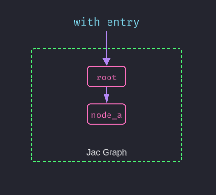
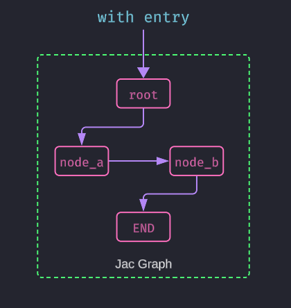

# Chapter 8: OSP Introduction and Paradigm Shift
---
Object-Spatial Programming (OSP) represents a fundamental shift in how we think about and organize computation. Instead of the traditional approach of moving data to computation, OSP moves computation to data. This chapter introduces this revolutionary paradigm through simple examples that demonstrate the power and elegance of spatial thinking.


Traditional programming brings all data to a central location for processing. OSP sends computation to where the data lives, creating more natural, efficient, and scalable programs.


## Journey from OOP to OSP
---
### `with entry` vs `if __name__ == "__main__":`
One of the first things you'll notice in Jac is the `with entry` block, which replaces the traditional Python `if __name__ == "__main__":` construct. This really isn't just syntactic sugar; it fundamentally changes how we think about program entry points for our Jac programs. Rather than beginning a program construct, we are entering an abstract space that is represented by a graph. In essence, we're entering the root of a global graph structure that we can build upon and traverse.

{ width=350px }
/// caption
`with entry` marks the entry point into the Jac program, allowing us to build and traverse a global graph structure.
///

### Creating a Node and adding it to the Graph
When the `with entry` block is executed, it creates a root node in the Jac graph. From there, we can add nodes and edges to build our data structure. Lets look at an example of creating a simple node using Jac's syntax:

```jac
node Node{
    has name: str;
}

with entry {
    node_a = Node(name="A");
}
```
<br />

{ width=350px }
/// caption
Adding a node to the graph.
///

Here, we define a node using the `node` keyword, which is similar to defining a class in traditional OOP. The `has` keyword declares properties for the node, and we create an instance of this node within the `with entry` block.

### Connecting Nodes with Edges
When the entry point is executed, it creates a root node on the Jac graph, which can be accessed using the `root` variable. This root node serves as the starting point for the program's graph structure, enabling traversal and manipulation of connected nodes.

In the example above, we create a new node `node_a` with the name "A". However, this node is not automatically part of the graph—it exists in isolation. To incorporate it into the graph, we need to connect it to an existing node using an edge.

This is where the `++>` operator comes in. It creates a directional edge from the root node to `node_a`, effectively linking the two and adding `node_a` into the graph.

```jac
node Node{
    has name: str;
}

with entry {
    node_a = Node(name="A");
    root ++> node_a;  # Add node_a to the root graph
}
```
<br />

{ width=350px }
/// caption
Adding a node to the graph.
///


### Building out the rest of the Graph
Now that we have a basic understanding of nodes and edges, let's add a few more nodes and edges to create a more complex graph structure. We'll introduce a second node and connect it to the first one:

```jac
node Node{
    has name: str;
}

with entry {
    node_a = Node(name="A");
    node_b = Node(name="B");

    root ++> node_a;  # Add node_a to the root graph
    node_a ++> node_b;  # Connect node_a to node_b
}
```
<br />

Next let's define a terminal node that will represent the end of our graph traversal. This node will not have any outgoing edges, indicating that it is a leaf node in our graph structure:

```jac
node EndNode {}
glob END = EndNode();  # Create a global end node
```
<br />

Now we can connect our nodes to this end node, creating a complete graph structure:
```jac
node Node{
    has name: str;
}
node EndNode {}
glob END = EndNode();

with entry {
    node_a = Node(name="A");
    node_b = Node(name="B");

    root ++> node_a;  # Add node_a to the root graph
    node_a ++> node_b;  # Connect node_a to node_b
    node_b ++> END;  # Connect node_b to the end node
}
```
<br />

{ width=350px }
/// caption
Filling out the graph with nodes and edges.
///

## From "Data to Computation" to "Computation to Data"
---

### Walking the Graph
One of the core innovations of Object-Spatial Programming (OSP) is the concept of **walkers**—mobile units of computation that traverse the graph, moving from node to node and edge to edge. Unlike traditional object-oriented programming, where methods are invoked on static data structures, OSP sends the logic itself to where the data resides.

Walkers operate **locally**, performing actions at each node or edge they encounter. This enables a more natural and efficient way to process distributed data, especially in systems modeled as networks, hierarchies, or flows.

But walkers are more than just graph crawlers—they can **maintain state**, **collect information** as they move, and **make decisions** based on the context of their current location. Since walkers are a subtype of the `object` archetype, they can define fields, store memory, and expose methods, making them ideal for modeling computation that evolves dynamically as it moves through the graph.

This shift—from pulling data into centralized logic to pushing computation outward into the graph—is what makes OSP so powerful. Walkers embody this paradigm by allowing logic to unfold spatially, with behavior adapting to the structure and content of the graph itself.

Getting back to our graph structure, lets define a simple walker that will traverse our graph and gather the names of the nodes it visits. When it reaches the terminal node, it will stop and return the collected names as a string:

First we define our walker archetype, that has a `input` field to store the names of the nodes it visits:
```jac
walker PathWalker {
    has input: str;
}
```
<br />

Next, we define the methods that the walker will use to traverse the graph. The `start` method is the entry point for the walker, and it will begin visiting nodes from the root node. The `visit_node` method will be called for each node it visits, and it will append the node's name to the `input` field. Finally, the `visit_end` method will be called when it reaches the terminal node, and it will return the collected names:

```jac
walker PathWalker {
    has input: str;

    can start with `root entry {
        visit [-->];  # Start visiting from the root node
    }

    can visit_node with Node entry {
        self.input += ", visiting " + here.name;  # Append node name to input
        visit [-->];  # Continue visiting the next node
    }

    can visit_end with EndNode entry {
        self.input += ", reached the end";  # Append end message
        return;  # Stop visiting
    }
}
```
<br />

### The `visit` Statement and `-->` Syntax
To understand how walkers move through the graph, it's important to break down the `visit` statement and the `-->` operator used in the example above.

In Jac, visit tells the walker to continue its traversal along the graph. What makes this powerful is the use of edge selectors inside the square brackets, like `[-->]`, which control how and where the walker moves.

The `-->` symbol represents a forward edge in the graph—specifically, an edge from the current node (`here`) to any of its connected child nodes. So when you write visit `[-->];`, you're instructing the walker to follow all outgoing edges from the current node to the next set of reachable nodes.

Let's walk through what each part means:

- `visit [-->];`: Move the walker along all forward edges from the current node.
- `visit [<--];`: Move backward (along incoming edges), useful for reverse traversals or backtracking.
- `visit [-->-->];`: Move along two forward edges in succession, allowing for deeper traversal into the graph.

Jac supports more complex edge selectors as well which we'll explore in subsequent chapters. For now, the key takeaway is that `visit` combined with edge selectors allows walkers to navigate the graph structure dynamically, processing nodes and edges as they go.


### Putting it All Together
Lets put everything together in a complete example that demonstrates how to create a graph, define a walker, and run it to collect node names:

```jac
node Node{
    has name: str;
}

node EndNode {}
glob END = EndNode();

walker PathWalker {
    has input: str;

    can start with `root entry {
        visit [-->];
    }

    can visit_node  with Node entry{
        self.input += ", visiting " + here.name;
        visit [here-->];
    }

    can visit_end with EndNode entry {
        self.input += ", reached the end";
        return;
    }
}

with entry {
    root ++> Node(name="A")
         ++> Node(name="B")
         ++> END;

    my_walker = PathWalker(input="Start walking") spawn root;

    print(my_walker.input);
}
```
<br />

```bash
$ jac run path_walker.jac
Start walking, visiting A, visiting B, reached the end
```
<br />


## Wrapping Up
---
In this chapter, we've introduced the core concepts of Object-Spatial Programming (OSP) and how it differs from traditional object-oriented programming. We've seen how Jac allows us to define nodes and edges, create walkers, and traverse graphs in a way that naturally reflects the relationships between data.


## Key Takeaways
---

- **Computation to data**: Move processing to where data naturally lives
- **Spatial relationships**: Model connections as first-class graph structures
- **Natural representation**: Express real-world relationships directly in code
- **Distributed processing**: Each data location can be processed independently

**Core Concepts:**

- **Nodes**: Stateful entities that hold data and can react to visitors
- **Edges**: First-class relationships with their own properties and behaviors
- **Walkers**: Mobile computation that traverses and processes graph structures
- **Graph thinking**: Shift from object-oriented to relationship-oriented design

**Key Advantages:**

- **Intuitive modeling**: Problems are expressed in their natural graph form
- **Efficient processing**: Computation happens exactly where it's needed
- **Scalable architecture**: Naturally distributes across multiple nodes
- **Maintainable code**: Clear separation of data, relationships, and processing logic


!!! tip "Try It Yourself"
    Start thinking spatially by modeling:
    - Family trees with person nodes and relationship edges
    - Social networks with user connections
    - Organization charts with employee and department relationships
    - Knowledge graphs with concept connections

    Remember: OSP shines when your problem naturally involves connected data!

---

*You've now grasped the fundamental paradigm shift of OSP. Let's build the foundation with nodes and edges!*
