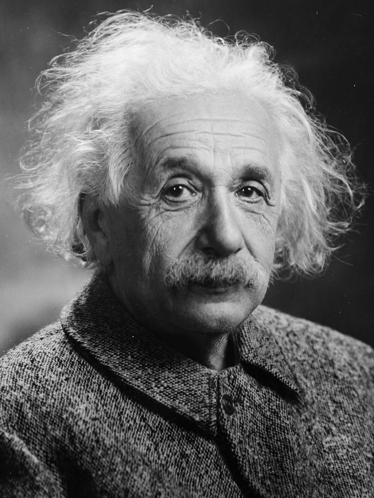

# Using Multi-modal Models

For MTLLM to have actual neurosymbolic powers, it needs to be able to handle multimodal inputs and outputs. This means that it should be able to understand text, images, and videos. In this section, we will discuss how MTLLM can handle multimodal inputs.

To Support Images and Videos, you need to install the following extra(s):

=== "Image Support"
    ```bash
    pip install mtllm[image]
    ```
=== "Video Support"
    ```bash
    pip install mtllm[video]
    ```

Currently, only multimodal LLMs from OpenAI and Anthropic are supported. In the future, we plan to support multimodal LLMs from other providers as well.

## Image

MTLLM can handle images as inputs. You can provide an image as input to the MTLLM Function or Method using the `Image` format of mtllm. Here is an example of how you can provide an image as input to the MTLLM Function or Method:

```jac
import from mtllm.llm {Model}
import from mtllm.types {Image, Text}

glob llm = Model(model_name="gpt-4o-mini");

'Personality of the Person'
enum Personality {
   INTROVERT = "Introvert",
   EXTROVERT = "Extrovert"
}

obj Person {
    has full_name: str,
        year_of_death: str,
        personality: Personality;
}

def get_person_info(image_content: Image) -> Person by llm();

with entry {
    image = Image("photo.jpg");
    person_obj = get_person_info(image);
    print(person_obj);
}
```

Input Image (person.png):


??? example "Output"
    Person(full_name='Albert Einstein', yod=1955, personality=Personality.INTROVERT)

In the above example, we have provided an image of a person ("Albert Einstein") as input to the `get_person_info` method. The method returns the information of the person in the image. The output of the method is a `Person` object with the name, year of death, and personality of the person in the image.

## Video

Similarly, MTLLM can handle videos as inputs. You can provide a video as input to the MTLLM Function or Method using the `Video` format of mtllm. Here is an example of how you can provide a video as input to the MTLLM Function or Method:

```jac
import from mtllm.llms {OpenAI}
import from mtllm {Video}

glob llm = OpenAI(model_name="gpt-4o");

def is_aligned(video: Video, text: str) -> bool
by llm(method="Chain-of-Thoughts", context="Mugen is the moving character");

with entry {
    video = Video("mugen.mp4", 1);
    text = "Mugen jumps off and collects few coins.";
    print(is_aligned(video, text));
}
```

Input Video:
[mugen.mp4](https://github.com/Jaseci-Labs/jaseci/blob/main/jac-mtllm/examples/vision/mugen.mp4)

??? example "Output"
    True

In the above example, we have provided a video of a character ("Mugen") as input to the `is_aligned` method. The method checks if the text is aligned with the video. The output of the method is a boolean value indicating whether the text is aligned with the video.