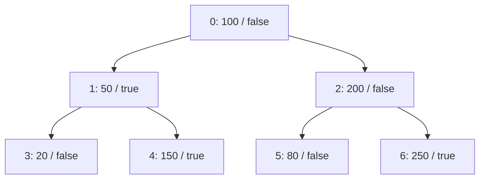

# Batched subtree queries on GPU

From the repository root, on a machine with Jac installed and an accessible
NVIDIA CUDA GPU:

```bash
jac run jac/examples/gpu/subtree_query_run.jac
```

The default run builds one tree with 255 nodes and submits 1024 independent
queries. It checks every GPU result against serial Jac and ends with:

```text
PASS: every GPU query matches serial Jac
```

Change the demo size or CUDA device:

```bash
jac run jac/examples/gpu/subtree_query_run.jac --nodes 1023 --queries 2048 --device 0
```

This is a correctness example, not a controlled performance benchmark.

## Graph and query semantics

Each `Item` node stores `amount: int` and `alert: bool`. Directed `Child` edges
form a tree. The small example uses this topology (labels show amount / alert):



Each `SubtreeQuery` starts at a chosen root with its own `threshold`. It visits
the root and every descendant, counting nodes whose `amount >= threshold` and
summing their amounts. `has_alert` is true only if a **matching** node has an
alert. `visited` counts all visited nodes, including those below the threshold.
Conditions affect accumulation, not traversal: all children are still visited.

For root 0 and threshold 100, matching amounts are 100, 200, 150, and 250;
the result is `count=4`, `total=700`, `has_alert=True`, `visited=7`.
Root 1 with the same threshold produces `count=1`, `total=150`, and
`has_alert=True`. Separate walkers can query overlapping subtrees with different
thresholds while sharing all graph nodes and adjacency.

The demo data helper creates a binary tree in heap order: node i has children
2*i+1 and 2*i+2 when those indices exist. Pass different amount and alert lists
to `make_tree` to change the data. Arbitrary trees can use the same `Item` and
`Child` declarations. General DAGs can cause repeated arrivals; this example
assumes a tree and does not implement a visited set.

## Execution and costs

The actual Jac ability in `subtree_query.jac` is compiled to PTX. The CSR runtime
runs one query per GPU thread; graph fields and adjacency are shared and
read-only, while counters, totals, flags, and thresholds are private per walker.
Results are available both on each walker and in `result.fields`.

The tree is constructed on the CPU once for the batch. Current runtime calls
still pack and upload the graph each time. Output separates graph construction,
serial validation, runtime setup/PTX compilation, and the GPU batch call. The
last measurement includes host packing, CUDA initialization when needed,
transfers, kernel execution, copyback, and publication; it is not kernel-only
time. Timings do not by themselves establish GPU speedup.

FIFO queue capacity and visit limits are set to the node count, which bounds
each traversal for this tree. Queue storage scales with nodes times walkers in
this conservative example. Capacity or arithmetic failures preserve the whole
batch's previous walker state.

## Source and checks

- `subtree_query.jac`: node, edge, and walker definitions.
- `subtree_query_data.jac`: demo tree construction.
- `subtree_query_run.jac`: CLI runner, serial validation, and result display.

Export the GPU kernel separately:

```bash
jac build jac/examples/gpu/subtree_query.jac --as ptx \
  --gpu-entry SubtreeQuery --gpu-graph-format csr -o dist/gpu-subtree
```

Run differential checks on a CUDA machine:

```bash
PYTHONPATH=jac JAC_GPU_TEST_CUDA=1 python3 -B scripts/gpu_walker/test_subtree.py -v
```

Without `JAC_GPU_TEST_CUDA=1`, the same tests exercise CPU LLVM lowering through
a CUDA driver double. Cases cover overlapping subtrees, different thresholds,
empty starts, warp boundaries, alert semantics, exact int64 values, immutable
graph data, and failure-before-publication.
